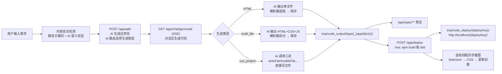
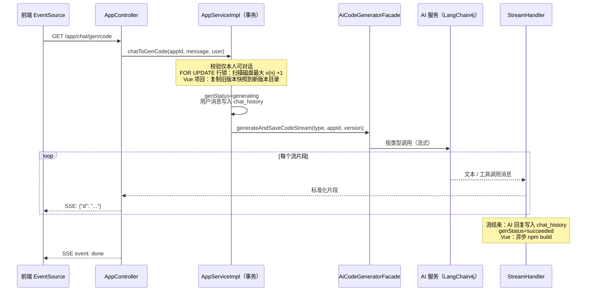
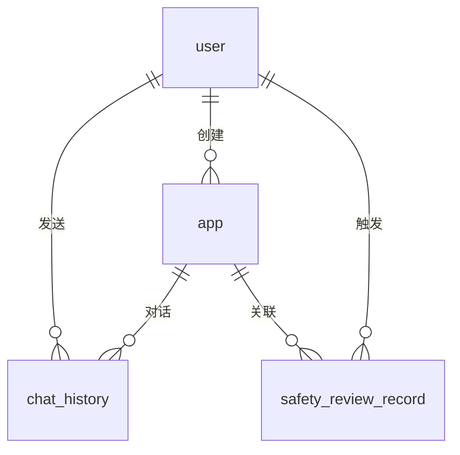

# README.md — AI 零代码应用生成平台项目说明

> 一句话定位：用户用自然语言描述需求，平台让 AI 直接生成可运行的网页应用（HTML 单页 / 多文件页面 / Vue 工程），支持**对话式迭代修改、多版本管理、一键预览、一键部署、版本回退**。
>
> 本文档以后端为核心，目标是让人"看一眼就能明白后端在干什么"；前端仅做概览。

---

## 1. 60 秒看懂后端（TL;DR）

后端只围绕四张表（`user` / `app` / `chat_history` / `safety_review_record`）和两个磁盘目录（`tmp/code_output`、`tmp/code_deploy`）展开，核心链路一句话：

**创建应用（内容安全检测 + AI 起名 + AI 选生成类型） → 对话生成代码（内容安全检测 → SSE 流式，AI 直接写文件或输出代码块） → 流结束后解析保存为版本目录 v1/v2/... → 静态预览 → 部署（Vue 先 npm build）→ 异步截图当封面 → 支持回退/下线/删除。**



应用生成状态机：`not_start → generating → succeeded / failed`（AI 流报错、保存失败、用户中途断开 SSE，都会置为 `failed`，避免状态卡死在"生成中"）。

---

## 2. 技术栈

| 层次 | 技术 | 用途 |
| --- | --- | --- |
| 语言/框架 | Java 21 + Spring Boot 3.5.4 | Web 服务、事务、虚拟线程异步任务 |
| ORM | MyBatis-Flex 1.11 | 数据访问、逻辑删除、`FOR UPDATE` 行锁 |
| 数据库 | MySQL 8 | 用户 / 应用 / 对话历史 |
| 缓存/会话 | Redis + Spring Session | 登录态（30 天）、LangChain4j 对话记忆存储 |
| AI | LangChain4j 1.1（OpenAI 兼容协议接 DeepSeek）+ Reactor | 结构化输出、流式生成、工具调用 |
| 工作流 | LangGraph4j 1.6 | 多节点编排（独立实验链路，见 4.10） |
| 截图 | Selenium（无头 Chrome）+ WebDriverManager | 部署成功后生成应用封面 |
| 对象存储 | 腾讯云 COS | 封面截图上传 |
| 工具库 | Hutool、Caffeine、Lombok、Knife4j | 文件/JSON/压缩、AI 服务实例缓存、API 文档 |

服务入口：`http://localhost:8123/api`（context-path 为 `/api`），接口文档 `http://localhost:8123/api/doc.html`（Knife4j，中文）。

---

## 3. 后端模块地图

按包浏览代码时，用这张表导航即可：

| 包 | 职责 | 关键类 |
| --- | --- | --- |
| `controller` | HTTP 入口 | `AppController`（核心）、`UserController`、`ChatHistoryController`、`StaticResourceController`、`SafetyReviewController`、`HealthController` |
| `service` / `service.impl` | 业务逻辑 | `AppServiceImpl`（应用全生命周期）、`ChatHistoryServiceImpl`、`UserServiceImpl`、`ScreenshotServiceImpl`、`ProjectDownloadServiceImpl`、`ContentSafetyServiceImpl`（内容安全）、`SafetyReviewRecordServiceImpl`（审查记录） |
| `ai` | AI 服务定义与工厂 | `AiCodeGeneratorService`（@SystemMessage 声明式 AI 接口）、`AiCodeGeneratorServiceFactory`（实例缓存 + 记忆 + 工具装配）、`AiCodeGenTypeRoutingService`（类型智能路由）、`SensitiveContentCheckService`（敏感内容语义检测） |
| `ai.tools` | AI 可调用的工具 | `ToolManager` + `BaseTool` 五件套：写文件/改文件/读文件/读目录/删文件 |
| `core` | 生成编排门面 | `AiCodeGeneratorFacade`（统一生成+保存入口） |
| `core.parser` | 代码解析器 | `HtmlCodeParser`、`MultiFileCodeParser`、`CodeParserExecutor`（策略模式） |
| `core.saver` | 代码保存器 | 模板方法模式：`CodeFileSaverTemplate` → HTML / 多文件两个实现，统一写入 `v{version}` 目录 |
| `core.handler` | 流式响应处理器 | `StreamHandlerExecutor` 按类型分发：`SimpleTextStreamHandler`（HTML/多文件）、`JsonMessageStreamHandler`（Vue 工程含工具调用） |
| `core.builder` | 项目构建 | `VueProjectBuilder`（npm install + npm run build，带超时） |
| `langgraph4j` | 工作流引擎 | `CodeGenWorkflow` + 5 个节点（图片收集→提示词增强→路由→生成→构建） |
| `model` | 实体 / DTO / VO / 枚举 | `App`、`ChatHistory`、`User`、`SafetyReviewRecord`；`CodeGenTypeEnum` 等状态枚举 |
| `aop` / `annotation` | 权限 | `@AuthCheck(mustRole)` + `AuthInterceptor`（管理端接口统一校验） |
| `manager` / `utils` | 外部能力 | `CosManager`（COS 上传）、`WebScreenshotUtils`（Selenium 截图压缩） |
| `common` / `exception` | 横切 | `BaseResponse` 统一响应、全局异常处理器、`ThrowUtils` 断言 |
| `resources/prompt` | AI 提示词 | system prompt 文件（HTML / 多文件 / Vue 工程 / 类型路由 / 应用起名 / 图片收集 / 敏感内容检测 / 代码质量检查） |
| `dev.langchain4j.*`（源码内） | 库补丁 | 同包名覆盖 LangChain4j 少量内部类，定制流式工具调用行为 |

---

## 4. 核心功能逻辑（重点阅读）

### 4.1 用户与登录态

- 注册：账号 >= 4 位、密码 >= 8 位、两次一致、账号唯一；密码 = `MD5(盐"ag" + 密码)`；默认角色 `user`。
- 登录：校验后把 `User` 写入 Session（属性 `USER_LOGIN_STATE`）。Spring Session 已切到 Redis，**30 天有效**，重启后端不掉登录态。
- 鉴权：业务接口在方法内手动调 `userService.getLoginUser(request)` 做身份/归属校验；管理端接口用 `@AuthCheck(mustRole = "admin")` + AOP 统一拦截。
- 头像上传：限制 5MB、jpg/jpeg/png/gif/webp，UUID 重命名存到 `tmp/avatar/`，返回 `/api/avatar/xxx`（`WebMvcConfig` 已注册 `/avatar/**` → `tmp/avatar/` 的静态资源映射，可直接访问）。

### 4.2 创建应用：AI 起名 + AI 智能路由

`POST /api/app/add`，流程只有五步：

1. AI 根据初始描述生成应用名（失败兜底取描述前 12 字，最长 20 字，清洗引号/换行）。
2. AI 路由服务用**结构化输出**直接返回 `CodeGenTypeEnum`：`html` / `multi_file` / `vue_project`，类型在建应用时就定死。
3. 可见性校验（`public`/`private`，默认公开）、标签规范化（中文逗号兼容、去重、最多 3 个、单个最长 20 字符）。
4. `genStatus = not_start`，入库。
5. 返回应用 id，前端跳到对话页开始生成代码。

### 4.3 对话生成代码（全平台最核心的链路）

入口：`GET /api/app/chat/gen/code?appId=&message=`，`text/event-stream`（SSE）。前端用原生 `EventSource` 消费，每个数据帧是 `{"d": "文本片段"}`，流末尾追加一个 `event: done` 标记结束。



分步拆解：

1. **权限**：只有应用创建者本人能和自己的应用对话。
2. **预留版本号（并发安全）**：`chatToGenCode` 带 `@Transactional`，内部 `SELECT ... FOR UPDATE` 锁住应用行，然后**扫描磁盘上已存在的最大 `v{n}` 目录 + 1** 作为新版本号，并在锁内创建目录、写回 `currentVersion`。为什么不用 `currentVersion + 1`？因为回退是"指针式"的（currentVersion 会变小），如果按指针 +1 会撞掉历史目录；磁盘目录只增不减，永远不冲突。
3. **Vue 项目快照**：Vue 工程是 AI 拿着工具在旧代码上做增量修改的，所以生成前必须把上一个有效版本（含 `package.json`）完整复制进新版本目录，历史版本永不被污染。HTML/多文件是整体重写，不需要快照。
4. **AI 服务实例（工厂 + 缓存）**：`AiCodeGeneratorServiceFactory` 按 `appId:type:version` 做键，用 Caffeine 缓存实例（最多 1000 个，写后 30 分钟/读后 10 分钟过期）。每个实例挂一份对话记忆：`MessageWindowChatMemory`（20 条窗口）+ Redis 持久化；实例创建时还会从 MySQL `chat_history` 加载历史（跳过最新一条用户消息，时间正序回放）。
5. **三种生成类型的差异**：

| 类型 | 模型 | 输出方式 | 落盘方式 |
| --- | --- | --- | --- |
| `html` | 默认 chat 模型 | 流式输出一个完整 HTML 文件 | 流结束后 `HtmlCodeParser` 提取代码 → 保存器写入 `v{n}/index.html` |
| `multi_file` | 默认 chat 模型 | 流式输出 HTML+CSS+JS 代码块 | 流结束后拆分三个文件保存 |
| `vue_project` | 推理流式模型（工具调用） | `TokenStream`：AI 边回复边调用工具 | AI 通过工具直接写文件，无需解析器 |

6. **流式协议**：HTML/多文件直接透传文本片段；Vue 工程的 `TokenStream` 被转成 JSON 消息流，三种消息类型：`ai_response`（AI 文本）、`tool_request`（开始调用工具，前端显示"选择工具：写入文件"）、`tool_executed`（工具执行结果，含写入的文件内容，格式化后展示并存入历史）。`JsonMessageStreamHandler` 按工具 id 去重，避免重复提示。
7. **流结束的两件事**（`StreamHandlerExecutor` 分发到对应 Handler 的 `doOnComplete`）：
   - AI 回复全文写入 `chat_history`（messageType = `ai`）；
   - `genStatus = succeeded`；Vue 项目还会异步触发 `VueProjectBuilder.buildProjectAsync`（虚拟线程跑 `npm install`（5 分钟超时）+ `npm run build`（3 分钟超时），Windows 下自动用 `npm.cmd`），构建产物 `dist/` 留给部署用。
8. **失败兜底**：`doOnError` / `doOnCancel`（用户中途关页面）都会把状态置 `failed` 并把失败信息存入历史；HTML/多文件流中"保存失败"也会让流以错误结束，避免"状态成功但磁盘没文件"。

### 4.4 AI 工具系统（Vue 工程模式的双手）

`ToolManager` 启动时自动注册所有 `BaseTool` 实现，随 AI 服务注入。AI 只能操作**当次版本目录**内的文件（相对路径会被拼到 `tmp/code_output/vue_project_{appId}/v{version}/` 下）：

| 工具 | 作用 | 备注 |
| --- | --- | --- |
| `writeFile` | 写入/覆盖文件 | 参数缺失、IO 异常都返回文本提示而不是抛异常，防止 LangChain4j 把 null 结果写回记忆导致整条流中断 |
| `modifyFile` | 按"旧内容 → 新内容"精确替换 | 找不到旧内容时返回警告，不盲目修改 |
| `readFile` / `readDir` / `deleteFile` | 读文件 / 列目录 / 删文件 | 让 AI 能感知工程现状、做删除和重构 |

另外配置了 `hallucinatedToolNameStrategy`：AI 幻觉出不存在的工具名时，把错误信息作为工具结果写回对话，让模型自我纠正。

### 4.5 版本管理：多版本 + 指针式回退

```
tmp/code_output/{type}_{appId}/
├── v1/        ← 历史版本，只增不改
├── v2/
└── v3/        ← currentVersion 当前指向这里
```

- **版本列表**：扫描 `v{n}` 目录，按版本号倒序，标记哪个是当前版本。
- **回退**（`POST /app/version/rollback`）：指针式——直接把 `currentVersion` 指回目标版本，不复制文件。因为新版本号永远取"磁盘最大版本 + 1"，回退后再生成也绝不会覆盖历史。若应用处于"已上线"状态，回退会同步把目标版本文件重新发布到部署目录（发布失败则数据库回滚，版本号不动）。
- **下载**（`GET /app/download/{appId}?version=`）：把指定版本（默认当前版本）打成 zip 流式返回，自动排除 `node_modules`、`dist`、`.git` 等目录。

### 4.6 部署 / 下线：URL 稳定 + 自动封面

部署（`POST /app/deploy`，仅本人）：

1. `deployKey` 首次部署随机生成 8 位，**之后一直复用**——保证部署 URL 永不变化。
2. 源 = 当前版本目录；Vue 项目先同步 `npm build`，用 `dist/` 作为部署源。
3. 整体复制到 `tmp/code_deploy/{deployKey}/`，更新 `deployKey / deployedTime / deployStatus=online`。
4. 部署 URL = `{CODE_DEPLOY_HOST}/{deployKey}/`（默认 `http://localhost`，需要你自己把 `tmp/code_deploy` 映射到该主机的静态根目录，例如 nginx）。
5. **异步封面**：虚拟线程里用无头 Chrome 打开部署 URL → 截图 → Hutool 压缩（质量 0.3）→ 上传腾讯云 COS（`/screenshots/yyyy/MM/dd/xxx.jpg`）→ 回写 `app.cover`。

下线（`POST /app/undeploy`，本人或管理员）：删除部署目录（URL 立即 404），`deployStatus=offline`，但 **deployKey 保留**，重新部署 URL 不变。下线状态下回退版本不会偷偷把文件发布回线上。

### 4.7 预览、可见性与运营功能

- **预览**：`GET /api/static/{type}_{appId}/v{n}/**` 直接从 `tmp/code_output` 读文件，目录访问自动兜底 `index.html`，HTML/CSS/JS 显式 UTF-8 防乱码。部署后的访问不走这个接口（走外部静态主机）。
- **可见性**：应用分 `public`/`private`。详情接口：本人和管理员看一切；其他人/游客只能看公开的，私有应用直接报无权限。
- **我的应用列表**：只查自己的，每页最多 20。
- **精选列表**：固定查 `priority >= 99`（精选 99、置顶 999 都算），按优先级倒序——置顶永远排最前。游客只能看到公开精选。该接口挂了 **Redis 缓存**（`@Cacheable("good_app_page")`，key 由 `CacheKeyUtils` 按查询参数生成，仅缓存前 10 页，TTL 30 分钟，见 `RedisCacheManagerConfig`），管理端对应用的增删改会更新数据但当前**没有**主动清除该缓存，最长 30 分钟后自动过期。
- **置顶/取消置顶**：`priority` 置 999 / 复位 0，纯排序技巧。
- **标签**：最多 3 个、单个 <= 20 字符、逗号分隔存储，查询用 LIKE 模糊匹配。
- **删除**（本人或管理员）：先删对话历史 → 逻辑删除应用记录 → 尽力清理版本目录和部署目录（清理失败只记日志，不阻塞主流程）。

### 4.8 对话历史：双存储设计

| 存储 | 内容 | 用途 |
| --- | --- | --- |
| MySQL `chat_history` | 用户消息 + AI 回复全文（含工具调用展示文本） | 页面分页展示、重启后回放 |
| Redis（LangChain4j ChatMemoryStore） | 20 条消息窗口 | AI 生成时的对话上下文 |

查询用**游标分页**（`lastCreateTime` < 创建时间，配合 `(appId, createTime)` 索引），只有创建者和管理员能查。应用删除时历史一并删除。

### 4.9 管理端

所有管理端接口（应用管理、用户管理、对话管理）通过 `@AuthCheck(mustRole = "admin")` AOP 校验，支持应用的增删改查、用户的增删改查（新建用户默认密码 `12345678`）、全量对话历史分页。

### 4.10 LangGraph4j 工作流（独立实验链路）

`langgraph4j` 包里有一条完整的多节点工作流（目前**未接入** `AppController` 主业务，属于编排能力储备 / 演示）：

```
START → 图片收集（AI 挑选配图 URL） → 提示词增强（把素材清单拼进 prompt）
      → 智能路由（AI 选类型，失败兜底 HTML） → 代码生成（复用 AiCodeGeneratorFacade）
      → 项目构建（Vue 构建 / 直接返回目录） → END
```

节点间通过 `WorkflowContext` 传递状态，图片收集节点背后挂了搜图 / Logo 生成 / Mermaid 图 / Undraw 插画四个 AI 工具。

### 4.11 横切约定

- 统一响应 `{code, data, message}`；业务错误抛 `BusinessException`，全局异常处理器兜底。
- 所有 Long 序列化为字符串（`JsonConfig`），避免前端 JS 精度丢失。
- CORS 全放行（含 Cookie），生产环境应收紧。
- 生成代码、部署产物、头像、截图临时文件全部集中在项目运行目录的 `tmp/` 下，方便整体清理。

### 4.12 内容安全与审查记录（双层检测 + 审计）

用户输入在进入 AI 生成链路**之前**会过一道内容安全检测（`ContentSafetyServiceImpl`），挂载了两个入口：`/app/add` 的初始描述、`/chat/gen/code` 的每轮对话消息。

```
用户消息 → ① 静态检测（敏感词表 + 注入正则，毫秒级零成本）
             ├─ 命中 → 写审查记录(static/blocked) → 拦截
             └─ 未命中 → ② AI 语义检测（独立模型，结构化输出）
                           ├─ 判定敏感 → 写审查记录(ai/blocked) → 拦截
                           ├─ 判定安全 → 放行，进入正常生成流程
                           └─ 调用失败/超时 → 降级放行 + 写审查记录(ai/failed_open)
```

要点：

1. **AI 检测是独立配置的模型**：`SensitiveContentCheckChatModelConfig`（前缀 `langchain4j.open-ai.sensitive-content-check-chat-model`）定义 prototype 级非流式 `ChatModel`，由 `SensitiveContentCheckServiceFactory` 装配成 `SensitiveContentCheckService`。和主生成模型、路由模型完全隔离，可单独换便宜/快速的模型。**必须是非流式 `ChatModel`**——langchain4j 的结构化输出（返回 `SensitiveCheckResult` POJO：sensitive/category/riskLevel/reason）不支持流式模型。
2. **拦截方式与 SSE 错误协议闭环**：命中抛 `BusinessException(SENSITIVE_CONTENT=40302)` → 全局异常处理器识别 SSE 请求后发送 `event: business-error` → 前端 `AppChatPage.vue` 已有监听，直接把错误消息展示为 ❌ 气泡。
3. **审查记录表 `safety_review_record`**：记录 userId、appId、userMessage（截断）、detectionType（static/ai）、triggerRule（命中规则）、riskCategory/riskLevel/aiReason（AI 判定）、handleResult（blocked 已拦截 / failed_open 检测异常降级放行）、clientIp（解析 X-Forwarded-For）。落库失败只记日志不影响主流程；`failed_open` 专门用于观察检测服务的健康度。`/app/add` 的检测特意放在事务方法之前执行，避免拦截异常连带回滚、丢失审计记录。
4. **纵深防御**：langchain4j 模型调用层的 `PromptSafetyInputGuardrail`（静态护栏）保留不动，作为检测漏斗之后的第二道防线。
5. 管理端分页查询：`POST /api/safetyReview/list/page`（仅 admin），支持按用户/应用/检测方式/处理结果过滤。

---

## 5. API 速查表

### 应用 `/api/app`

| 方法 | 路径 | 说明 |
| --- | --- | --- |
| POST | `/add` | 创建应用（AI 起名 + AI 路由类型） |
| GET | `/chat/gen/code` | **对话生成代码（SSE 流式）** |
| POST | `/update` | 更新自己的应用（名称/可见性/标签） |
| POST | `/deploy` | 部署应用（Vue 自动 build） |
| POST | `/undeploy` | 下线应用（URL 404，key 保留） |
| GET | `/version/list` | 版本列表 |
| POST | `/version/rollback` | 回退到指定版本 |
| GET | `/download/{appId}` | 下载指定版本 zip |
| POST | `/delete` | 删除自己的应用（含磁盘清理） |
| GET | `/get/vo` | 应用详情（含可见性校验） |
| POST | `/my/list/page/vo` | 我的应用分页 |
| POST | `/good/list/page/vo` | 精选应用分页 |
| POST | `/pin` `/unpin` | 置顶 / 取消置顶 |
| POST | `/admin/delete` `/admin/update` `/admin/list/page/vo` `/admin/get/vo` | 管理端（@AuthCheck admin） |

### 用户 `/api/user`

`/register`、`/login`、`/logout`、`/get/login`、`/update/my`、`/avatar/upload`；管理端：`/add`、`/get`、`/get/vo`、`/delete`、`/update`、`/list/page/vo`。

### 对话历史 `/api/chatHistory`

`GET /app/{appId}` 游标分页（本人或管理员）；`POST /admin/list/page/vo` 管理端分页。

### 内容安全审查记录 `/api/safetyReview`（仅管理员）

`POST /list/page` 审查记录分页查询（支持按 userId / appId / detectionType / handleResult 过滤）。

### 其他

`GET /api/static/{type}_{appId}/v{n}/**` 预览生成产物；`GET /api/health/` 健康检查。

---

## 6. 数据模型



| 表 | 关键字段 | 说明 |
| --- | --- | --- |
| `user` | userAccount(唯一)、userPassword、userRole、isVip 等 | 逻辑删除；密码 MD5+盐 |
| `app` | initPrompt、codeGenType、**currentVersion**、deployKey(唯一)、deployStatus、genStatus、visibility、tags、priority | `currentVersion` 既是计数器又是"当前生效版本"指针；`genStatus` 驱动前端轮询；`deployKey` 保证部署 URL 稳定 |
| `chat_history` | appId、message、messageType(user/ai)、createTime | `(appId, createTime)` 复合索引支撑游标分页 |
| `safety_review_record` | userId、appId、userMessage、detectionType、triggerRule、riskCategory、riskLevel、aiReason、handleResult、clientIp | 内容安全审查记录；detectionType 区分 static/ai，handleResult 区分 blocked/failed_open；见 4.12 |

建表脚本：`sql/create_table.sql`（文末附有增量迁移 ALTER 语句）。注意：脚本里"复制式回退"的注释是早期方案，**当前代码实现的是指针式回退**，以代码为准。

---

## 7. 磁盘目录约定

```
{项目运行目录}/tmp/
├── code_output/            # AI 生成的代码（预览源）
│   └── {type}_{appId}/     # 如 vue_project_1、html_2
│       ├── v1/             # 每个版本一个目录，只增不改
│       ├── v2/
│       └── v3/
├── code_deploy/            # 部署产物（对外服务源）
│   └── {deployKey}/        # 8 位随机 key，URL = CODE_DEPLOY_HOST/{deployKey}/
├── avatar/                 # 用户头像
└── screenshots/            # 截图临时目录（用后即删，正式图在 COS）
```

---

## 8. 关键设计决策（为什么这么写）

1. **版本号用"磁盘扫描 + 行锁"而不是 currentVersion+1**：指针式回退会让 currentVersion 变小，+1 会覆盖历史；磁盘目录只增不减天然免疫。
2. **版本号可能"跳空"**：生成前就创建 `v{n}` 目录，若 AI 失败会留下空目录且 currentVersion 指向它——所有读取方（列表/部署/静态访问）都有存在性校验兜底，这是预留制方案的已知取舍。
3. **SSE 断开 = 失败**：`doOnCancel` 把状态置 `failed`，避免应用永远卡在"生成中"。
4. **工具异常不抛出，返回文本**：LangChain4j 要求工具结果非空，否则异常写回记忆会中断整条生成流；所有工具都把错误格式化为提示文本让 AI 自行纠正。
5. **deployKey 一次生成永久复用**：下线/重部署 URL 不变，外部引用不失效。
6. **文件清理"尽力而为"**：删应用时磁盘清理失败只记日志，数据库逻辑删除才是主语义。
7. **AI 起名/路由都带兜底**：起名失败用描述前 12 字；类型路由失败（工作流内）兜底 HTML——AI 的不确定性不阻断主流程。

---

## 9. 前端简介（简略）

- 技术栈：Vue 3 + TypeScript + Vite 7 + Ant Design Vue 4 + Pinia + Vue Router；API 层由 `openapi2ts` 从后端 Knife4j/OpenAPI 文档自动生成（`src/api/`），改后端接口后跑 `npm run openapi2ts` 即可同步。
- 页面：首页（精选应用）、登录/注册、个人主页、**应用对话页**（核心，EventSource 消费 SSE，实时渲染 AI 文本与工具调用卡片）、应用编辑页、管理端三个页面（用户/应用/对话管理）。
- 对接方式：axios `baseURL` 指向后端 `/api`，`withCredentials: true` 携带 Session Cookie；开发环境 Vite 代理 `/api → http://localhost:8123`；全局响应拦截器处理 40100 未登录自动跳登录页。

---

## 10. 快速启动

前置依赖：JDK 21、MySQL 8、Redis、Node.js 18+（含 npm）、本机 Chrome（截图用）。

```bash
# 1. 初始化数据库
mysql -uroot -p < sql/create_table.sql

# 2. 后端配置（密钥放本地 profile，勿提交）
#    src/main/resources/application-local.yml 需要：
#    - langchain4j.open-ai.chat-model.base-url / api-key（OpenAI 兼容端点，如 DeepSeek）
#    - cos.client.* 腾讯云 COS 配置（截图封面上传）
#    数据库/Redis 默认连 localhost，密码见 application.yml

# 3. 启动后端（端口 8123，context-path /api）
.\mvnw.cmd spring-boot:run
# 接口文档：http://localhost:8123/api/doc.html

# 4. 启动前端
cd ag-ai-code-mother-frontend
npm install
npm run dev
# 访问：http://localhost:5173
```

部署访问的前提：把 `tmp/code_deploy/` 映射到 `CODE_DEPLOY_HOST`（默认 `http://localhost`）的静态根目录（nginx `root` 指向该目录即可），否则部署 URL 打不开。

## 11. 已知注意事项

- Vue 项目构建依赖本机 npm 环境与网络（npm install）；部署超时已设 5+3 分钟。
- 精选应用列表的 Redis 缓存 key 只含查询参数、不含用户身份，且应用增删改时未主动清除——管理端改完精选应用最长 30 分钟才对前台可见；如需即时生效可在管理端更新入口加 `@CacheEvict`。
- 生产环境需要收紧 CORS（当前全放行）、更换 MD5+盐为 BCrypt 等更强哈希、把数据库/Redis 密码移出配置文件。
- `dev/langchain4j/` 目录是对 LangChain4j 内部类的同包名补丁，升级 LangChain4j 版本时需要回归验证流式工具调用。
- AI 敏感内容检测会给 `/app/add` 和 `/chat/gen/code` 各增加一次大模型调用的时延（约 1~3 秒）；检测失败默认降级放行（写入 `failed_open` 记录），如合规要求更严可改为失败即拦截。
