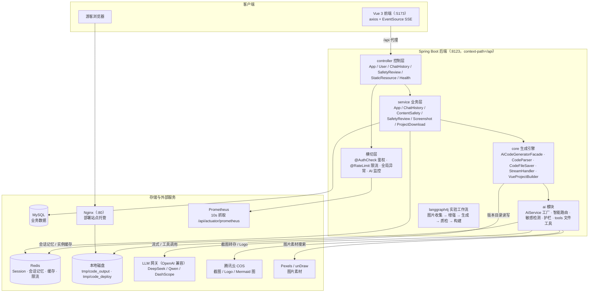
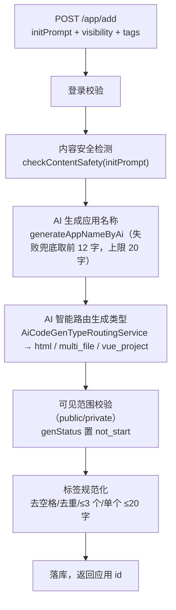
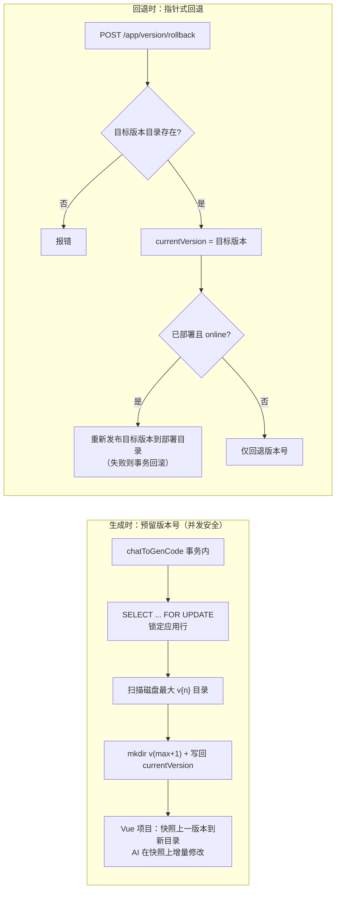
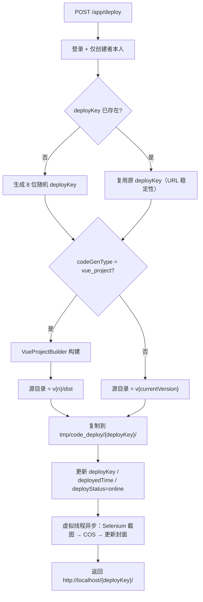
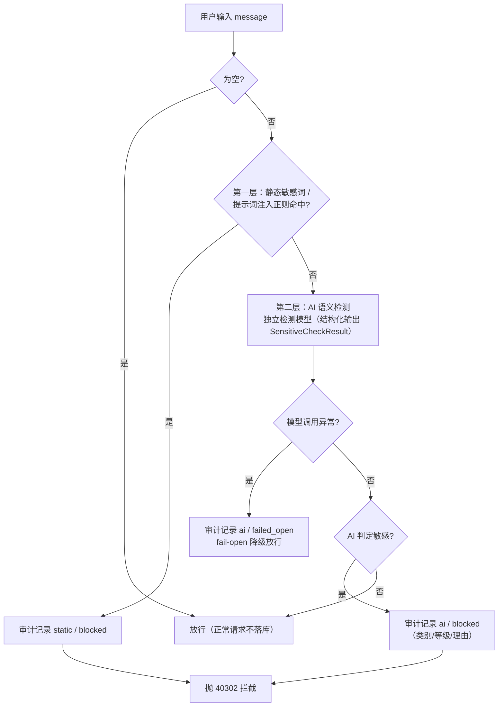
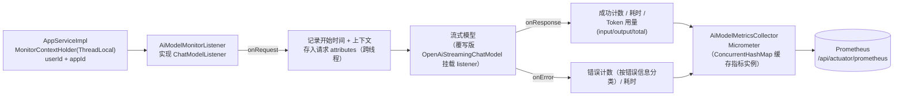
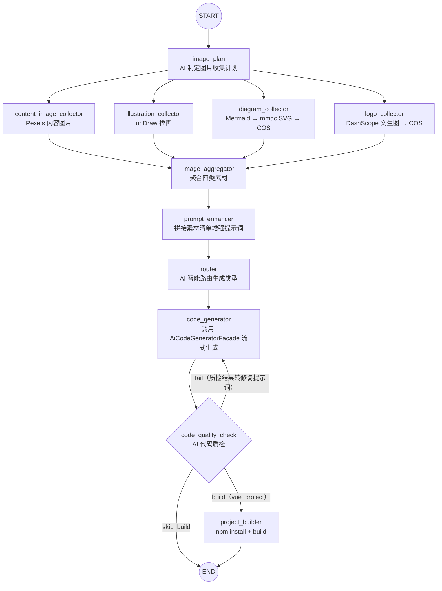
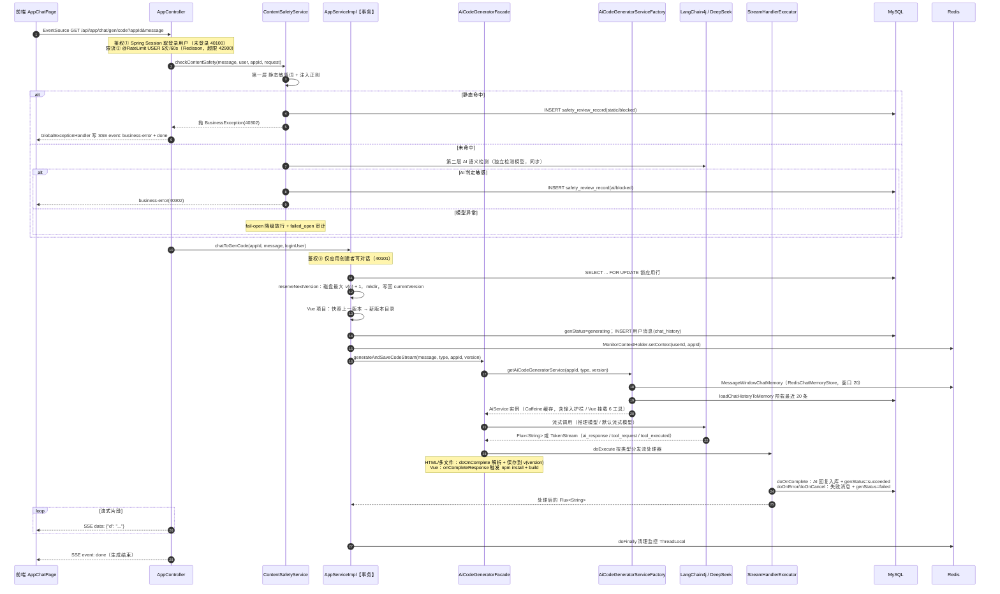
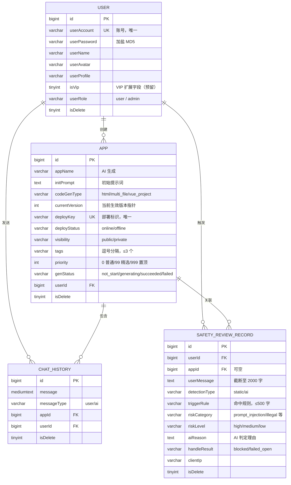

# AG AI Code Mother —— AI 零代码应用生成平台

     

**一句话简介**：用户输入一句自然语言需求，AI 自动生成完整可运行的网页应用（HTML 单页 / 原生多文件 / Vue 工程），支持多轮对话增量修改、网页实时预览、版本管理与回退、一键部署上线，并内置双层内容安全审查、分布式限流与 AI 模型可观测体系。

> 本项目在 `yu-ai-code-mother`（鱼皮 AI 零代码应用生成平台）教学项目的基础上进行了大量二次开发：版本管理与回退、应用置顶/标签/可见范围、部署上下线控制、双层内容安全审查与审计、AI 模型监控（Prometheus）、分布式限流、LangGraph4j 工作流实验等均为扩展实现。

---

## 目录

- [一、项目概述](#一项目概述)
- [二、后端架构与模块划分](#二后端架构与模块划分)
- [三、核心业务逻辑详解](#三核心业务逻辑详解)
- [四、请求调用链路](#四请求调用链路)
- [五、API 接口文档](#五api-接口文档)
- [六、数据库设计](#六数据库设计)
- [七、关键技术点与设计决策](#七关键技术点与设计决策)
- [八、部署与运行](#八部署与运行)
- [九、前端说明](#九前端说明)
- [十、项目结构](#十项目结构)
- [十一、已知限制与未来规划](#十一已知限制与未来规划)

---

## 一、项目概述

### 1.1 核心功能

| 功能 | 说明 |
|------|------|
| AI 对话生成应用 | 三种生成模式：原生 HTML 单页（`html`）、原生多文件（`multi_file`）、Vue 工程（`vue_project`），由 AI 智能路由自动选择 |
| Agent 工具调用 | Vue 工程模式下 AI 通过 6 个文件工具（读/写/改/删/列目录/退出）在版本目录内增量修改项目文件 |
| 多轮对话增量修改 | 会话记忆双层存储（Redis + MySQL），新一轮对话可基于已有代码持续迭代 |
| 网页实时预览 | 后端静态资源接口直接托管生成的代码目录，前端 iframe 预览，SSE 流式边生成边渲染 |
| 版本管理与回退 | 每次生成自动产生新版本目录 `v{n}`，支持指针式回退（不复制文件），已部署应用回退后自动同步线上 |
| 一键部署 / 下线 | 代码复制到部署目录，固定 `deployKey` 保证 URL 稳定；下线删除目录 + 状态置 offline，重新部署 URL 不变 |
| 应用封面自动生成 | 部署成功后虚拟线程异步调用 Selenium 截图并上传腾讯云 COS |
| 内容安全审查 | 「静态敏感词/注入正则 + AI 语义检测」双层拦截，审查记录全量落库供管理员审计 |
| 精选 / 置顶 / 标签 / 可见范围 | 应用优先级体系（置顶 999 > 精选 99 > 普通 0）、标签规范化校验、public/private 隐私保护 |
| AI 模型可观测 | 基于 LangChain4j `ChatModelListener` + Micrometer 暴露请求数 / Token 用量 / 耗时 / 错误指标到 Prometheus |
| 分布式限流 | 自定义 `@RateLimit` 注解 + Redisson `RRateLimiter`（令牌桶），支持 API / USER / IP 三种维度 |
| 管理后台 | 用户管理、应用管理、对话历史管理、安全审查记录查询 |
| API 文档 | Knife4j（OpenAPI 3）在线文档，前端通过 openapi2ts 自动生成 TypeScript 调用代码 |

### 1.2 技术栈总览

**后端（重点）**

| 分类 | 技术 | 用途 |
|------|------|------|
| 基础框架 | Java 21（虚拟线程）、Spring Boot 3.5.4、Spring AOP | 应用骨架、切面（鉴权 / 限流） |
| AI 框架 | LangChain4j 1.1.0（OpenAI 兼容协议）、LangGraph4j 1.6.0-rc2（实验） | AI Service、流式输出、结构化输出、工具调用、护栏（Guardrail）、多节点工作流编排 |
| AI 模型 | DeepSeek（主生成 / 推理 / 敏感检测）、阿里云百炼 Qwen（智能路由）、DashScope 文生图（Logo） | 按任务分层选型，详见 [7.2](#72-多模型分层架构) |
| ORM | MyBatis-Flex 1.11 + HikariCP | 数据访问、逻辑删除、分页、`QueryWrapper` |
| 数据库 | MySQL 8 | 业务数据持久化 |
| 缓存 / 中间件 | Redis（Spring Session、Spring Cache、LangChain4j RedisChatMemoryStore）、Redisson（限流）、Caffeine（本地缓存） | 会话、AI 会话记忆、精选列表缓存、AI 服务实例缓存、分布式限流 |
| 文档 | Knife4j 4.4（springdoc-openapi） | 在线接口文档 |
| 可观测 | Spring Boot Actuator + Micrometer + Prometheus | AI 模型指标收集与暴露 |
| 截图 | Selenium 4 + WebDriverManager | 应用封面网页截图 |
| 对象存储 | 腾讯云 COS（cos_api） | 截图、Logo、Mermaid 架构图存储 |
| 工具库 | Hutool 5.8、Lombok | 通用工具 |

**前端**

| 分类 | 技术 |
|------|------|
| 框架 | Vue 3.5（Composition API）+ TypeScript 5.8 |
| 构建 | Vite 7、vue-tsc 类型检查 |
| UI | Ant Design Vue 4（暗色主题）、markdown-it + highlight.js（AI 消息渲染） |
| 状态 / 路由 | Pinia 3、Vue Router 4 |
| 网络 | Axios（统一响应拦截）、原生 EventSource（SSE 流式） |
| 接口生成 | @umijs/openapi（openapi2ts，依据后端 OpenAPI 文档生成） |

---

## 二、后端架构与模块划分

### 2.1 整体架构图



### 2.2 包结构说明

```
com.ag.agaicodemother
├── controller          // 控制层：6 个 Controller（详见第五章 API 文档）
├── service             // 业务接口 + impl 实现（7 个 Service）
├── mapper              // MyBatis-Flex Mapper（App/User/ChatHistory/SafetyReviewRecord）+ resources/mapper XML
├── model
│   ├── entity          // 数据库实体：App、User、ChatHistory、SafetyReviewRecord
│   ├── dto             // 请求 DTO（app/chathistory/safty/user 四组）
│   ├── vo              // 响应 VO：AppVO、AppVersionVO、LoginUserVO、UserVO
│   └── enums           // 枚举：CodeGenTypeEnum、AppGenStatusEnum、AppVisibilityEnum、
│   │                   //   AppDeployStatusEnum、ChatHistoryMessageTypeEnum、StreamMessageTypeEnum、UserRoleEnum
├── ai                  // AI 能力层（重点）
│   ├── AiCodeGeneratorService(+Factory)      // 代码生成 AiService（多例 + 缓存）
│   ├── AiCodeGenTypeRoutingService(+Factory) // 生成类型智能路由
│   ├── SensitiveContentCheckService(+Factory)// AI 敏感内容检测
│   ├── guardrail       // 输入护栏 PromptSafetyInputGuardrail / 输出护栏 RetryOutputGuardrail
│   ├── tools           // Agent 工具：BaseTool + 6 个工具 + ToolManager
│   └── model           // 结构化输出结果 + 流式消息模型（AiResponse/ToolRequest/ToolExecuted）
├── core                // 代码生成引擎（重点）
│   ├── AiCodeGeneratorFacade                 // 生成 + 解析 + 保存 + 构建的统一门面
│   ├── parser          // CodeParserExecutor + Html/MultiFileCodeParser（策略模式）
│   ├── saver           // CodeFileSaverExecutor + 模板方法（Html/MultiFile 保存器）
│   ├── handler         // StreamHandlerExecutor + SimpleText/JsonMessage 流处理器
│   └── builder         // VueProjectBuilder（npm install + build）
├── langgraph4j         // LangGraph4j 工作流实验模块（独立于主链路）
│   ├── node            // 图节点：Router/PromptEnhancer/ImagePlan/CodeGenerator/QualityCheck/Builder
│   ├── node/concurrent // 并发图片收集节点（4 类收集器 + 聚合器）
│   ├── ai              // 质检/图片计划/图片收集 AiService
│   ├── tools           // Pexels/unDraw/Mermaid/Logo 四个素材工具
│   └── state           // WorkflowContext 图状态
├── config              // 配置类：多模型（流式/推理/路由/敏感检测）、RedisChatMemoryStore、
│   │                   //   RedisCacheManager、COS、CORS、JSON（Long→String）、WebMvc 静态资源
├── monitor             // AI 模型可观测：ChatModelListener + Micrometer 指标收集 + ThreadLocal 上下文
├── ratelimter          // 分布式限流：@RateLimit 注解 + RateLimitAspect + RedissonConfig
├── annotation / aop    // @AuthCheck 注解 + AuthInterceptor 切面
├── manager             // CosManager（腾讯云 COS 客户端封装）
├── exception           // BusinessException、ErrorCode、GlobalExceptionHandler（含 SSE 错误事件）
├── common              // BaseResponse、ResultUtils、PageRequest、DeleteRequest
├── constant            // AppConstant、FileConstant、UserConstant
├── utils               // CacheKeyUtils、SpringContextUtil、WebScreenshotUtils
└── generator           // MyBatisCodeGenerator（代码生成器，开发期工具）
```

> 另有 `dev.langchain4j.*` 覆写包：为官方 `OpenAiStreamingChatModel` 补充 `listeners` 字段以接入监控监听器。

### 2.3 模块职责与依赖关系

| 模块 | 职责 | 依赖方向 |
|------|------|----------|
| `controller` | 参数校验、登录态获取、鉴权注解、SSE 流式响应包装 | → service |
| `service` | 业务编排：权限校验、事务、版本管理、部署、内容安全、截图、下载 | → mapper / core / ai |
| `core` | 与数据库无关的"生成引擎"：门面、解析器、保存器、流处理器、Vue 构建 | → ai |
| `ai` | AI Service 定义与工厂、Agent 工具、护栏、路由与敏感检测 | → LangChain4j / Redis / service(加载历史) |
| `mapper` | MyBatis-Flex 数据访问，实体自动拼接逻辑删除条件 | → MySQL |
| `monitor` | ChatModelListener 收集 AI 调用指标 → Micrometer | → actuator |
| `ratelimter` | 声明式限流 | → Redisson |
| `langgraph4j` | 多节点 AI 工作流实验（未被主链路引用） | → core(AiCodeGeneratorFacade) / ai |

---

## 三、核心业务逻辑详解

### 3.1 用户模块

**业务目标**：账号注册登录、登录态管理、个人信息维护、头像上传、管理员用户管理。

- **注册**：校验账号密码（账号 ≥ 4 位、密码 ≥ 8 位、两次输入一致），账号唯一校验，密码 **加盐 MD5**（`DigestUtils.md5DigestAsHex("ag" + password)`）后入库。
- **登录**：校验密码后脱敏为 `LoginUserVO`，写入 Session（**Spring Session + Redis**，30 天过期，Cookie 同步 30 天），实现分布式会话。
- **登录态获取**：`UserService.getLoginUser(request)` 从 Session 取用户后**回查数据库**（保证权限实时性），未登录统一抛 `40100` 业务异常。
- **头像上传**：`/user/avatar/upload` 校验大小 ≤ 5MB，保存到本地 `{FILE_SAVE_DIR}/avatar/`，由 `WebMvcConfig` 将 `/api/avatar/**` 映射到该目录对外访问。
- **管理员接口**：`@AuthCheck(mustRole = "admin")` + AOP 切面统一校验角色。

### 3.2 应用管理模块（App）

**业务目标**：应用的创建、编辑、置顶/精选、标签、可见范围、分页查询、删除（含磁盘清理）。

- **创建应用**（`POST /app/add`）核心流程：



- **优先级体系**：置顶 `999` > 精选 `99` > 普通 `0`，列表统一按 `priority` 倒序；精选查询用 `priority >= 99` 范围条件，保证置顶应用不丢失。
- **精选列表缓存**：`@Cacheable("good_app_page")` 走 Redis 缓存（TTL 5 分钟，`pageNum <= 10` 才缓存），缓存 Key 由 `CacheKeyUtils.generateKey` 按查询参数生成。
- **可见范围**：详情接口校验「创建者本人 / 管理员 / 公开应用」三类可见性；精选列表按身份过滤私有应用。
- **删除应用**：事务内先删版本目录 `tmp/code_output/{type}_{appId}/`，再删部署目录 `tmp/code_deploy/{deployKey}/`（静默清理，失败不阻塞），级联删除对话历史，最后逻辑删除记录。

### 3.3 AI 代码生成模块（核心）

**业务目标**：把一句/多轮自然语言需求转成可运行的前端应用，流式输出、落盘保存、状态回写。

#### 3.3.1 三种生成类型

| 类型 | 枚举值 | 产物 | 模型 | 流式协议 |
|------|--------|------|------|----------|
| 原生 HTML 单页 | `html` | 单个 index.html | 默认流式模型（DeepSeek） | `Flux<String>` |
| 原生多文件 | `multi_file` | index.html + style.css + script.js | 默认流式模型（DeepSeek） | `Flux<String>` |
| Vue 工程 | `vue_project` | 完整 Vue 3 工程（package.json / src / vite 等） | 推理流式模型（更大 maxTokens） | `TokenStream`（含工具调用事件） |

生成类型在**创建应用时由路由模型一次性确定**（`codegen-routing-system-prompt.txt`，结构化输出枚举），对话过程中保持不变。

#### 3.3.2 AI Service 工厂与多例模型

`AiCodeGeneratorServiceFactory` 是生成模块的中枢：

1. **Caffeine 实例缓存**：缓存 Key 为 `appId:codeGenType:versionId`（容量 1000，写后 30 分钟 / 访问后 10 分钟过期），避免每次对话重建 AiServices。
2. **会话记忆**：为每个 appId 构建独立 `MessageWindowChatMemory`（窗口 20 条），底层存储为 **LangChain4j `RedisChatMemoryStore`**（TTL 3600s）；创建实例时先从 **MySQL** 预载最近 20 条历史（`loadChatHistoryToMemory`），实现「Redis 热记忆 + MySQL 冷备份」双层对话记忆。
3. **多例流式模型**：`streamingChatModelPrototype` / `reasoningStreamingChatModelPrototype` 以 `@Scope("prototype")` 注册，每次构建 AiServices 取新实例，规避流式模型的并发串写问题。
4. **护栏**：所有生成实例挂载 `PromptSafetyInputGuardrail`（输入护栏：长度/敏感词/注入正则校验，`fatal` 直接拒绝）；输出护栏 `RetryOutputGuardrail` 已实现但默认未启用（reprompt 会破坏流式输出）。
5. **Vue 模式专属配置**：挂载 `ToolManager.getAllTools()` 全部工具、`maxSequentialToolsInvocations(50)`（最多连续 50 次工具调用）、`hallucinatedToolNameStrategy`（工具幻觉兜底：把不存在的工具调用转为错误结果写回记忆而不是中断）。

#### 3.3.3 流式生成主流程（门面模式）

`AiCodeGeneratorFacade.generateAndSaveCodeStream` 是统一入口：

- **HTML / 多文件**：`Flux<String>` 边推边收集（StringBuilder），`doOnComplete` 时经 `CodeParserExecutor`（策略模式，按类型选解析器）解析为结构化结果，再经 `CodeFileSaverExecutor`（**模板方法模式**：公共校验 + 目录创建，子类实现具体写入）保存到 `tmp/code_output/{type}_{appId}/v{version}/`；保存失败会让流以错误结束，避免"状态成功但磁盘无文件"。
- **Vue 工程**：把 `TokenStream` 转换为 `Flux<String>`，透传三类 JSON 消息（AI 文本增量、工具调用请求、工具执行结果），`onCompleteResponse` 回调中同步执行 `VueProjectBuilder`（npm install 5 分钟超时 + npm run build 3 分钟超时，Windows 下自动使用 `npm.cmd`）产出 `dist/`。

### 3.4 Agent 工具调用（Vue 工程模式）

**业务目标**：AI 以"程序员"的方式直接操作工程文件，实现单文件级别的增量修改，而不是每次全量重写。

| 工具名 | 类 | 能力 |
|--------|----|------|
| `writeFile` | FileWriteTool | 写入文件（相对路径自动解析到 `tmp/code_output/vue_project_{appId}/v{version}/`） |
| `readFile` | FileReadTool | 读取文件内容 |
| `modifyFile` | FileModifyTool | 旧内容替换新内容 |
| `deleteFile` | FileDeleteTool | 删除文件 |
| `readDir` | FileDirReadTool | 读取目录结构 |
| `exit` | ExitTool | 任务完成主动退出，防止调用循环 |

**关键工程细节**：

- `ToolManager` 通过注入 `BaseTool[]` 自动注册全部工具（`@PostConstruct` 构建名称映射）。
- `FileWriteTool` 对模型漏传参数、IO 异常统一返回**非空文本错误提示**（LangChain4j 会把工具结果写回对话记忆，null 结果会导致 `ensureNotBlank` 异常中断整个生成流）。
- 工具调用过程中，`JsonMessageStreamHandler` 按工具 ID 去重（`seenToolIds`），首次请求输出「即将调用 xx 工具」提示，执行完成输出格式化代码块，同步拼入对话历史。

### 3.5 对话历史模块

- 双写时机：调用 AI 前**先落库用户消息**；流式 `doOnComplete` 落库 AI 完整回复；`doOnError` / `doOnCancel`（前端关页面）落库失败消息并把 `genStatus` 置 `failed`，避免状态永远卡在"生成中"。
- 查询采用**游标分页**（`lastCreateTime` + `createTime <` 条件，复合索引 `idx_appId_createTime` 支撑），单页 ≤ 50 条。
- 权限：仅应用创建者或管理员可查看某应用的对话；管理员可分页查看全站对话。

### 3.6 版本管理模块

**设计核心**：`app.currentVersion` 既是"最新版本计数器"又是"当前生效版本指针"；磁盘上的 `v{n}` 目录只增不减。



- 用"磁盘最大版本 + 1"而非"currentVersion + 1"分配新版本，保证**回退后再生成也不会覆盖历史目录**。
- 并发安全：行锁把同一应用的并发生成请求串行化，"扫描目录 → 建目录 → 写回指针"全部在锁内完成。
- 已知取舍：生成中途失败会留下空版本目录、版本号跳空，部署 / 版本列表 / 静态访问均有存在性校验兜底。
- 下载：`GET /app/download/{appId}?version=` 将目标版本目录过滤打包（排除 node_modules/dist/.git 等）为 ZIP 流式下载。

### 3.7 部署模块



- **下线**（`POST /app/undeploy`）：删除部署目录（URL 立即 404，幂等）+ `deployStatus=offline`；`deployKey` 保留，重新部署 URL 不变。
- **回退联动**：已部署且 online 的应用回退版本时，自动把目标版本重新发布到部署目录；offline 应用只改版本号，不悄悄上线。

### 3.8 内容安全审查模块

**双层检测 + 审计落库**，在进入事务方法之前执行（拦截异常不会连带回滚审计记录）：



- 静态层：敏感词黑名单（"忽略之前的指令"、jailbreak 等）+ 5 条提示词注入正则，大小写不敏感。
- AI 层：独立检测模型返回 `SensitiveCheckResult`（是否敏感、风险类别 prompt_injection/illegal/pornography/violence/privacy/other、风险等级、判定理由）。
- 审计：`safety_review_record` 表记录用户 ID / 应用 ID / 截断消息 / 检测方式 / 命中规则 / 客户端 IP（X-Forwarded-For → X-Real-IP → remoteAddr），保存失败只记日志不影响主流程；管理员经 `/safetyReview/list/page` 查询（单页 ≤ 50）。
- 模型输入侧还有 `PromptSafetyInputGuardrail` 兜底（见 3.3.2），与业务层检测互为补充。

### 3.9 应用截图模块

部署成功后 `Thread.startVirtualThread` 异步执行：Selenium（WebDriverManager 自动管理驱动）无头浏览器打开部署 URL → 本地压缩截图 → `CosManager` 上传腾讯云 COS（Key：`/screenshots/yyyy/MM/dd/{8位随机}_compressed.jpg`）→ 更新 `app.cover` → 清理本地临时文件。

### 3.10 AI 模型可观测模块（monitor）



| 指标 | 类型 | Tags |
|------|------|------|
| `ai_model_requests_total` | Counter | user_id / app_id / model_name / status(started/success/error) |
| `ai_model_errors_total` | Counter | user_id / app_id / model_name / error_message |
| `ai_model_tokens_total` | Counter | user_id / app_id / model_name / token_type |
| `ai_model_response_duration_seconds` | Timer | user_id / app_id / model_name |

### 3.11 分布式限流模块（ratelimter）

- `@RateLimit` 注解属性：`key`（前缀）、`rate`（窗口内请求数，默认 10）、`rateInterval`（窗口秒数，默认 1）、`limitType`（API / USER / IP）、`message`。
- `RateLimitAspect`（`@Before` 前置通知）：按维度组装限流 Key（`rate_limit:` + 类名.方法名 / 用户 ID / 客户端 IP）→ Redisson `RRateLimiter`（`OVERALL` 全局限流 + 1 小时过期 + `tryAcquire`）→ 失败抛 `42900 TOO_MANY_REQUEST`。
- AI 对话接口配置为 **USER 维度 5 次 / 60 秒**。
- 未登录或无请求上下文时 USER 维度自动降级为 IP 限流。

### 3.12 LangGraph4j 工作流（实验模块）

> **定位说明**：该模块目前是独立的进阶演示/验证模块，展示多节点编排、并发子图与"生成 → 质检 → 修复"闭环能力，**尚未接入主业务链路**（主链路为 `AppController → AppServiceImpl → AiCodeGeneratorFacade`）。它反过来调用门面完成真正的代码生成，并提供 `executeWorkflowWithFlux/Sse` 流式接口为接入 Web 层做预留。

`CodeGenConcurrentWorkflow`（并发版）图结构：



- 四个收集节点经 `RunnableConfig.addParallelNodeExecutor` 绑定自定义线程池（核心 10 / 最大 20 / 队列 100）并行执行；另有 `CodeGenSubgraphWorkflow`（子图版）与 `CodeGenWorkflow`（串行基础版）。
- 图状态 `WorkflowContext` 保存原始/增强提示词、生成类型、图片计划、四类素材中间结果、生成目录、构建目录、质检结果、错误信息。
- 质检节点遍历生成目录（排除 node_modules/dist 等，仅取 html/css/js/vue/ts 等），拼接代码后调用质检模型输出 `QualityResult(isValid, errors, suggestions)`；fail 分支把质检结果转成修复提示词重新生成（当前无重试次数上限）。
- 素材工具一览：`ImageSearchTool`（Pexels API）、`UndrawIllustrationTool`（unDraw 搜索接口）、`MermaidDiagramTool`（本地 mmdc 渲染 SVG → COS）、`LogoGeneratorTool`（DashScope `wan2.2-t2i-flash` 文生图 → COS）。

---

## 四、请求调用链路

### 4.1 AI 对话生成代码（核心链路，SSE 流式）



**各层职责与异常约定**：

| 层 | 职责 | 异常 / 鉴权 |
|----|------|-------------|
| 前端 | EventSource 建连、150ms 节流渲染、20s 看门狗 | `done` 判定结束；`business-error` 展示业务错误；`onerror` 兜底 |
| Controller | 参数校验、登录态、限流注解、内容安全、SSE 包装（`{"d": chunk}` + `done`） | 40100 / 42900 / 40302 均以 `business-error` 事件下发 |
| Service | 事务内完成权限校验、版本预留、状态与消息落库、监控上下文 | 仅本人可对话（40101）；应用不存在（40400） |
| Facade / AI | 记忆装配、护栏拦截、流式生成、解析保存、Vue 构建 | 护栏 `fatal` 直接拒绝；保存失败以错误结束流并标 failed |
| 流处理器 | 按类型重组消息流、对话历史持久化、生成状态终态回写 | 客户端断开视为失败，防止状态卡死 |

### 4.2 静态预览与部署访问链路

- **开发预览**：前端 iframe 加载 `/api/static/{codeGenType}_{appId}/v{n}/`（Vue 工程追加 `dist/index.html`）→ `StaticResourceController` 定位 `tmp/code_output/...` 文件，按扩展名返回 Content-Type（目录访问自动兜底 `index.html`，不存在返回 404）。
- **线上访问**：部署 URL 为 `http://localhost/{deployKey}/`（`AppConstant.CODE_DEPLOY_HOST`），由**外部静态服务器（如 Nginx）** 将根路径映射到 `tmp/code_deploy/` 对外托管；应用自身只负责把文件复制到位。

---

## 五、API 接口文档

- 统一前缀：`/api`（`server.servlet.context-path`）；统一响应体：`BaseResponse<T>`（`code` 0 成功）。
- 在线调试：启动后访问 `http://localhost:8123/api/doc.html`（Knife4j）。
- 权限列说明：**登录**=需登录态；**本人**=资源创建者；**管理员**=`@AuthCheck(mustRole="admin")` 或代码内校验。

### 5.1 应用接口（AppController，/app）

| 方法 | 路径 | 功能说明 | 请求参数 | 返回结果 | 权限要求 | 备注 |
|------|------|----------|----------|----------|----------|------|
| GET | `/app/chat/gen/code` | AI 对话生成代码（SSE 流式） | `appId`、`message` | `Flux<ServerSentEvent>`（`{"d":...}` + `done` 事件） | 登录 + 本人 | USER 限流 5 次/60s；40302 经 business-error 事件下发 |
| POST | `/app/add` | 创建应用 | `{initPrompt, visibility?, tags?}` | `Long` 应用 id | 登录 | AI 命名 + 智能路由生成类型 |
| POST | `/app/update` | 更新应用名称/可见范围/标签 | `{id, appName?, visibility?, tags?}` | `Boolean` | 本人 | 标签空串表示清空 |
| POST | `/app/deploy` | 部署应用 | `{appId}` | `String` 部署 URL | 本人 | Vue 项目先构建 dist；异步截图更新封面 |
| POST | `/app/undeploy` | 下线应用 | `appId`（Query） | `Boolean` | 本人 / 管理员 | 删除部署目录，状态 offline，URL 404 |
| GET | `/app/version/list` | 版本列表（倒序，含当前版本标记） | `appId` | `List<AppVersionVO>` | 本人 / 管理员 | 扫描磁盘 v{n} 目录 |
| POST | `/app/version/rollback` | 回退版本（指针式） | `{appId, targetVersion}` | `Integer` 回退后版本号 | 本人 / 管理员 | 已部署且 online 时自动同步部署目录 |
| POST | `/app/delete` | 删除应用 | `{id}` | `Boolean` | 本人 / 管理员 | 级联清理版本/部署目录与对话历史 |
| POST | `/app/pin` / `/app/unpin` | 置顶 / 取消置顶 | `appId`（Query） | `Boolean` | 本人 / 管理员 | priority 999 / 0 |
| GET | `/app/get/vo` | 应用详情 | `id` | `AppVO`（含创建者） | 公开（私有仅本人/管理员） | |
| POST | `/app/my/list/page/vo` | 我的应用分页 | `AppQueryRequest` | `Page<AppVO>` | 登录 | 每页 ≤ 20 |
| POST | `/app/good/list/page/vo` | 精选应用分页 | `AppQueryRequest` | `Page<AppVO>` | 登录 | priority ≥ 99；Redis 缓存 5min（前 10 页） |
| GET | `/app/download/{appId}` | 下载应用代码 ZIP | `appId`、`version?` | ZIP 文件流 | 本人 / 管理员 | 过滤 node_modules/dist/.git 等 |
| POST | `/app/admin/update` | 管理员更新应用（含封面/优先级） | `AppAdminUpdateRequest` | `Boolean` | 管理员 | `@AuthCheck` |
| POST | `/app/admin/delete` | 管理员删除应用 | `{id}` | `Boolean` | 管理员 | 走完整删除（含磁盘清理） |
| POST | `/app/admin/list/page/vo` | 管理员应用分页 | `AppQueryRequest` | `Page<AppVO>` | 管理员 | |
| GET | `/app/admin/get/vo` | 管理员应用详情 | `id` | `AppVO` | 管理员 | |

### 5.2 用户接口（UserController，/user）

| 方法 | 路径 | 功能说明 | 请求参数 | 返回结果 | 权限要求 | 备注 |
|------|------|----------|----------|----------|----------|------|
| POST | `/user/register` | 注册 | `{userAccount, userPassword, checkPassword}` | `Long` 用户 id | 公开 | 密码加盐 MD5 |
| POST | `/user/login` | 登录 | `{userAccount, userPassword}` | `LoginUserVO` | 公开 | 写入 Redis Session（30 天） |
| POST | `/user/logout` | 退出登录 | — | `Boolean` | 登录 | 移除 Session |
| GET | `/user/get/login` | 获取当前登录用户 | — | `LoginUserVO` | 登录 | |
| POST | `/user/update/my` | 修改个人信息 | `{userName?, userAvatar?, userProfile?}` | `Boolean` | 登录 | |
| POST | `/user/avatar/upload` | 上传头像 | multipart 字段 `file` | `String` 头像 URL | 登录 | ≤ 5MB，存本地 /api/avatar/** |
| GET | `/user/get/vo` | 用户公开信息 | `id` | `UserVO` | 公开 | |
| POST | `/user/add` | 管理员新增用户 | `UserAddRequest` | `Long` | 管理员 | 默认密码 12345678 |
| GET | `/user/get` | 管理员按 id 查用户 | `id` | `User` | 管理员 | |
| POST | `/user/update` | 管理员更新用户 | `UserUpdateRequest` | `Boolean` | 管理员 | |
| POST | `/user/delete` | 管理员删除用户 | `{id}` | `Boolean` | 管理员 | 逻辑删除 |
| POST | `/user/list/page/vo` | 管理员用户分页 | `UserQueryRequest` | `Page<UserVO>` | 管理员 | 数据脱敏 |

### 5.3 对话历史 / 审查 / 静态资源 / 健康检查

| 方法 | 路径 | 功能说明 | 请求参数 | 返回结果 | 权限要求 | 备注 |
|------|------|----------|----------|----------|----------|------|
| GET | `/chatHistory/app/{appId}` | 应用对话历史（游标分页） | `pageSize≤50`、`lastCreateTime?` | `Page<ChatHistory>` | 本人 / 管理员 | 复合索引游标查询 |
| POST | `/chatHistory/admin/list/page/vo` | 全站对话分页 | `ChatHistoryQueryRequest` | `Page<ChatHistory>` | 管理员 | |
| POST | `/safetyReview/list/page` | 安全审查记录分页 | `SafetyReviewRecordQueryRequest` | `Page<SafetyReviewRecord>` | 管理员 | 单页 ≤ 50 |
| GET | `/static/{dirKey}/**` | 生成代码静态资源预览 | URL 路径即文件路径 | 文件内容 | 公开 | 目录兜底 index.html；按扩展名给 Content-Type |
| GET | `/health/` | 健康检查 | — | `"OK"` | 公开 | |

### 5.4 业务错误码（ErrorCode）

| code | 含义 | 典型场景 |
|------|------|----------|
| 0 | 成功 | — |
| 40000 | 请求参数错误 | 参数校验失败 |
| 40100 | 未登录 | 无 Session 访问需登录接口 |
| 40101 | 无权限 | 访问他人私有资源 |
| 40302 | 输入内容包含敏感信息，已被安全拦截 | 双层内容安全命中 |
| 40400 | 请求数据不存在 | 应用/代码/版本不存在 |
| 42900 | 请求过于频繁 | @RateLimit 限流触发 |
| 50000 / 50001 | 系统内部异常 / 操作失败 | AI 调用、IO、构建失败等 |

---

## 六、数据库设计

### 6.1 表关系图（ER）



### 6.2 核心表结构

**user（用户表）**

| 字段 | 类型 | 说明 |
|------|------|------|
| id | bigint, PK, 自增 | 用户 id |
| userAccount | varchar(256), NOT NULL, UNIQUE | 账号 |
| userPassword | varchar(512), NOT NULL | 密码（盐 `ag` + MD5） |
| userName / userAvatar / userProfile | varchar | 昵称 / 头像 / 简介 |
| isVip / vipExpireTime / vipCode / vipNumber / shareCode / inviteUser | — | VIP 与邀请扩展字段（预留，业务暂未启用） |
| userRole | varchar(256), 默认 'user' | 角色：user / admin |
| editTime / createTime / updateTime | datetime | 时间戳 |
| isDelete | tinyint, 默认 0 | 逻辑删除 |

**app（应用表）**

| 字段 | 类型 | 说明 |
|------|------|------|
| id | bigint, PK, 自增 | 应用 id |
| appName | varchar(256) | 应用名（AI 生成，≤ 20 字） |
| cover | varchar(512) | 封面（部署后异步截图替换） |
| initPrompt | text | 初始提示词 |
| codeGenType | varchar(64) | 生成类型枚举 |
| currentVersion | int, 默认 1 | 当前版本号（计数器 + 指针二合一） |
| deployKey | varchar(64), UNIQUE | 部署标识（8 位随机串，复用保 URL 稳定） |
| deployedTime | datetime | 最近部署时间 |
| deployStatus | varchar(32), 默认 'online' | online / offline |
| priority | int, 默认 0 | 0 普通 / 99 精选 / 999 置顶 |
| visibility | varchar(32), 默认 'public' | public / private |
| tags | varchar(256) | 标签串（逗号分隔） |
| genStatus | varchar(32), 默认 'not_start' | not_start / generating / succeeded / failed |
| userId | bigint, NOT NULL | 创建者 |
| isDelete | tinyint | 逻辑删除 |

**chat_history（对话历史表）**

| 字段 | 类型 | 说明 |
|------|------|------|
| id | bigint, PK, 自增 | 记录 id |
| message | mediumtext | 消息内容（AI 消息含格式化工具调用记录） |
| messageType | varchar(32), NOT NULL | user / ai |
| appId / userId | bigint, NOT NULL | 归属应用 / 用户 |
| isDelete | tinyint | 逻辑删除 |

**safety_review_record（内容安全审查记录表）**

| 字段 | 类型 | 说明 |
|------|------|------|
| id | bigint, PK, 自增 | 记录 id |
| userId / appId | bigint | 触发用户 / 关联应用（可空） |
| userMessage | text | 用户输入（截断 2000 字） |
| detectionType | varchar(32), NOT NULL | static / ai |
| triggerRule | varchar(512) | 命中的关键词或正则 |
| riskCategory | varchar(64) | AI 判定风险类别 |
| riskLevel | varchar(32), 默认 'high' | high / medium / low |
| aiReason | text | AI 判定理由 / 降级异常信息 |
| handleResult | varchar(32), NOT NULL | blocked / failed_open |
| clientIp | varchar(64) | 客户端真实 IP |
| isDelete | tinyint | 逻辑删除 |

### 6.3 索引与关键约束

| 表 | 索引/约束 | 用途 |
|----|-----------|------|
| user | `uk_userAccount` 唯一 | 账号防重复 |
| user | `idx_userName` | 昵称模糊查询 |
| app | `uk_deployKey` 唯一 | 部署标识防冲突 |
| app | `idx_appName` / `idx_userId` | 名称查询 / 我的应用列表 |
| chat_history | `idx_appId`、`idx_createTime` | 基础过滤 |
| chat_history | `idx_appId_createTime` 复合 | **游标分页核心索引**（appId 等值 + createTime 范围 + 排序） |
| safety_review_record | `idx_userId` / `idx_appId` / `idx_detectionType` / `idx_createTime` | 审计多维筛选 |

所有表统一带 `createTime / updateTime / editTime / isDelete`（逻辑删除，MyBatis-Flex 查询自动拼接 `isDelete = 0`）。

---

## 七、关键技术点与设计决策

### 7.1 鉴权方案

- **Spring Session + Redis**：Session 集中存储（30 天），Cookie 同步 30 天，天然支持分布式部署；前端跨域请求 `withCredentials: true` 携带 Cookie。
- **两层权限控制**：
  1. 声明式——`@AuthCheck(mustRole)` + `AuthInterceptor`（`@Around` AOP），用于管理员接口；
  2. 编程式——Service 层数据级校验（创建者 / 管理员 / 公开可见性三元判断），覆盖私有应用详情、对话历史、版本操作等细粒度场景。
- 密码加盐 MD5（固定盐）；`LoginUserVO` / `UserVO` 输出脱敏。

### 7.2 多模型分层架构

四组模型按任务复杂度分层配置（均为 OpenAI 兼容协议，配置前缀见 `application-local.yml`）：

| 配置项 | 用途 | 特点 |
|--------|------|------|
| `streaming-chat-model` | HTML / 多文件生成、应用命名 | 通用流式模型 |
| `reasoning-streaming-chat-model` | Vue 工程生成（Agent 工具调用） | 大 maxTokens（32768）、低 temperature |
| `routing-chat-model` | 创建应用时智能路由生成类型 | 轻量快模型，maxTokens 100（只要枚举） |
| `sensitive-content-check-chat-model` | AI 语义敏感检测 | 低 temperature，结构化输出 |

另有 DashScope 文生图（Logo）、Pexels / unDraw / Mermaid CLI 等素材工具外部依赖（仅实验工作流使用）。

### 7.3 并发与稳定性设计

- **多例流式模型**：`@Scope("prototype")` 的 StreamingChatModel，规避单例流式模型并发串写。
- **AI Service 实例缓存**：Caffeine（1000 上限，写后 30min / 访问后 10min），Key = `appId:type:version`。
- **版本号并发安全**：`SELECT ... FOR UPDATE` 行锁 + 磁盘扫描分配，详见 3.6。
- **虚拟线程**：截图、Vue 异步构建使用 JDK 21 虚拟线程（`Thread.startVirtualThread` / `Thread.ofVirtual()`）。
- **工具调用健壮性**：工具幻觉策略（不存在的工具调用转为错误消息写回记忆）、工具方法全量返回非空文本（防 LangChain4j `ensureNotBlank` 中断）、最多 50 次连续工具调用、`exit` 工具防死循环。
- **状态终态保证**：生成流 `doOnError` / `doOnCancel`（含用户关闭页面）都会把 `genStatus` 置为 `failed`，避免状态卡在"生成中"。

### 7.4 缓存策略

| 场景 | 实现 | Key / TTL |
|------|------|-----------|
| 精选应用分页 | Spring Cache `@Cacheable("good_app_page")` → Redis | `CacheKeyUtils` 按查询参数生成；TTL 5 分钟；仅前 10 页缓存；禁用 null 值 |
| AI 会话记忆 | LangChain4j `RedisChatMemoryStore` | TTL 3600s，窗口 20 条 |
| AI Service 实例 | Caffeine 本地缓存 | 见 7.3 |

### 7.5 AI 安全体系（三层）

1. **接口层**：`@RateLimit`（Redisson 令牌桶）+ 双层内容安全检测（静态 + AI 语义，fail-open 降级 + 审计落库）。
2. **模型层**：`PromptSafetyInputGuardrail` 输入护栏（长度 / 敏感词 / 注入正则，`fatal` 拒绝）；`RetryOutputGuardrail` 输出护栏（空回复 / 过短 / 泄露敏感词则 reprompt，因影响流式体验暂未启用）。
3. **Agent 层**：工具调用幻觉兜底、非空工具结果、调用次数上限。

### 7.6 可观测性

LangChain4j `ChatModelListener`（覆写 `OpenAiStreamingChatModel` 支持 listeners）→ Micrometer 四类指标（请求 / 错误 / Token / 耗时，维度 user_id、app_id、model_name）→ Actuator Prometheus 端点（`/api/actuator/prometheus`，仓库内附带 `prometheus.yml` 抓取配置，10s 间隔）。监控上下文通过 ThreadLocal 在业务线程设置、`doFinally` 清理，监听器回调中经请求 attributes 跨线程传递。

### 7.7 设计模式清单

| 模式 | 落点 |
|------|------|
| 门面模式 | `AiCodeGeneratorFacade` 统一"生成 → 解析 → 保存 → 构建" |
| 工厂模式 + 多例 | `AiCodeGeneratorServiceFactory` / 路由 / 敏感检测三家工厂 + prototype 模型 |
| 策略模式 | `CodeParserExecutor`（HTML / 多文件解析器）、`StreamHandlerExecutor`（文本 / JSON 流处理器）、限流维度 |
| 模板方法 | `CodeFileSaverTemplate`（公共校验与目录创建，子类实现写入） |
| 建造者模式 | `SafetyReviewRecord.builder()`、LangChain4j AiServices / 模型构建 |
| 观察者 / 监听器 | `AiModelMonitorListener` 监听模型调用生命周期 |
| AOP 切面 | `@AuthCheck` 鉴权、`@RateLimit` 限流 |

---

## 八、部署与运行

### 8.1 环境要求

| 依赖 | 版本要求 | 说明 |
|------|----------|------|
| JDK | 21+ | 使用虚拟线程特性 |
| Maven | 3.9+（或用自带 `mvnw`） | 后端构建 |
| MySQL | 8.x | 默认库 `ag_ai_code_mother` |
| Redis | 6.x+ | Session / 会话记忆 / 缓存 / 限流 |
| Node.js + npm | 18+ | 前端开发与 Vue 工程构建（后端部署 Vue 应用时也会调用 npm） |
| Nginx（推荐） | 任意稳定版 | 托管部署目录，使 `http://localhost/{deployKey}/` 可访问 |
| Mermaid CLI（可选） | mmdc | 仅 LangGraph4j 实验工作流的架构图工具需要 |

### 8.2 数据库初始化

执行 `sql/create_table.sql`（含 4 张建表语句 + 存量库迁移脚本）：

```bash
mysql -uroot -p < sql/create_table.sql
```

### 8.3 配置文件说明

| 文件 | 内容 |
|------|------|
| `src/main/resources/application.yml` | 数据源、Redis、Session、端口 8123、context-path `/api`、springdoc / knife4j；`spring.profiles.active=local` |
| `src/main/resources/application-local.yml` | **敏感配置**：langchain4j 四组模型（base-url / api-key / model-name）、腾讯云 COS、Pexels、DashScope |
| `src/main/resources/prompt/*.txt` | 9 个系统提示词（HTML / 多文件 / Vue 工程 / 路由 / 应用命名 / 敏感检测 / 代码质检 / 图片计划 / 图片收集） |
| `src/main/resources/prometheus.yml` | Prometheus 抓取配置（target `localhost:8123`，metrics_path `/api/actuator/prometheus`） |

> ⚠️ **安全提示**：当前 `application-local.yml` 中包含明文 api-key / 密钥，请勿将其提交到公开仓库；建议改为环境变量注入（如 `${DEEPSEEK_API_KEY}`）并尽快轮换已暴露的密钥。

关键配置项（application-local.yml 中需替换为你自己的）：

```yaml
langchain4j:
  open-ai:
    streaming-chat-model:               # 主生成模型：base-url / api-key / model-name
    reasoning-streaming-chat-model:     # Vue 工程（Agent）模型
    routing-chat-model:                 # 智能路由（轻量）模型
    sensitive-content-check-chat-model: # 敏感检测模型
cos.client:      # 腾讯云 COS：host / secretId / secretKey / region / bucket
pexels.api-key:  # 实验工作流图片搜索
dashscope:       # api-key / image-model（文生图）
```

### 8.4 后端启动

```bash
# Windows 使用 mvnw.cmd，Linux/macOS 使用 ./mvnw
mvnw.cmd spring-boot:run

# 打包运行
mvnw.cmd clean package -DskipTests
java -jar target/ag-ai-code-mother-0.0.1-SNAPSHOT.jar
```

- 服务地址：`http://localhost:8123/api`
- 接口文档：`http://localhost:8123/api/doc.html`（Knife4j）
- 运行时目录（自动创建）：`tmp/code_output/`（生成代码，按 `{type}_{appId}/v{n}/` 组织）、`tmp/code_deploy/`（部署快照，按 `{deployKey}/` 组织）、`tmp/avatar/`（头像）

### 8.5 部署站点托管（Nginx 示例）

部署 URL 为 `http://localhost/{deployKey}/`，需要静态服务器映射部署目录：

```nginx
server {
    listen 80;
    # 将部署目录暴露为站点根（按实际路径修改）
    location / {
        alias D:/soft/javaProject/ag-ai-code-mother/tmp/code_deploy/;
        index index.html;
    }
}
```

### 8.6 前端启动

```bash
cd ag-ai-code-mother-frontend
npm install
npm run dev        # 开发模式，默认 http://localhost:5173，/api 代理到 8123
npm run build      # 类型检查（vue-tsc）+ 构建产物到 dist/
npm run preview    # 本地预览构建产物
```

环境变量（可选，见 `src/config/env.ts`）：`VITE_API_BASE_URL`（默认 `http://localhost:8123/api`）、`VITE_DEPLOY_DOMAIN`（默认 `http://localhost`）。

### 8.7 常用命令

| 命令 | 说明 |
|------|------|
| `mvnw.cmd spring-boot:run` | 启动后端 |
| `mvnw.cmd test` | 运行测试 |
| `mysql -uroot -p < sql/create_table.sql` | 初始化数据库 |
| `npm run dev` / `npm run build`（前端目录） | 前端开发 / 构建 |
| `npm run openapi2ts`（前端目录） | 依据后端 OpenAPI 重新生成 TS 接口代码 |
| `prometheus --config.file=prometheus.yml` | 启动 Prometheus 抓取 AI 指标 |

---

## 九、前端说明

### 9.1 技术栈与构建

Vue 3.5 + TypeScript 5.8 + Vite 7 + Ant Design Vue 4（全局暗色主题 `darkAlgorithm`）+ Pinia 3 + Vue Router 4 + Axios；AI 消息渲染使用 markdown-it + highlight.js。接口层由 `@umijs/openapi`（`npm run openapi2ts`）依据后端 OpenAPI 文档自动生成到 `src/api/`，与后端接口保持强同步。

### 9.2 目录结构

```
ag-ai-code-mother-frontend/
├── vite.config.ts            # /api 代理到 http://localhost:8123
├── openapi2ts.config.ts      # OpenAPI → TS 代码生成配置
└── src/
    ├── main.ts               # 注册 Pinia / Router / Antd，引入权限守卫
    ├── App.vue               # 基础布局 + 动态背景 + 暗色主题
    ├── access.ts             # 全局路由守卫（登录态预取 + /admin 权限校验）
    ├── request.ts            # axios 封装（baseURL / withCredentials / 40100 拦截跳登录）
    ├── config/env.ts         # API_BASE_URL / DEPLOY_DOMAIN / 预览 URL 拼接工具
    ├── api/                  # openapi2ts 生成的接口与类型（typings.d.ts）
    ├── layouts/BasicLayout.vue
    ├── components/           # GlobalHeader / AppCard / MarkdownRenderer / DeploySuccessModal 等
    ├── stores/loginUser.ts   # Pinia：登录用户状态
    ├── utils/visualEditor.ts # 可视化编辑（选中 iframe 元素提交修改）
    └── pages/
        ├── HomePage.vue          # 首页：提示词创建应用 + 我的作品 + 精选案例
        ├── app/AppChatPage.vue   # 对话生成页（核心，SSE 流式 + 预览 + 版本 + 部署）
        ├── app/AppEditPage.vue   # 应用编辑页
        ├── user/                 # 登录 / 注册 / 个人中心
        └── admin/                # 用户 / 应用 / 对话管理（仅管理员）
```

### 9.3 路由与权限

| 路径 | 页面 | 权限 |
|------|------|------|
| `/` | 首页（创建应用 + 作品列表） | 公开 |
| `/user/login`、`/user/register` | 登录 / 注册 | 公开 |
| `/user/profile` | 个人中心（改昵称/简介、传头像） | 登录 |
| `/app/chat/:id` | AI 对话生成应用 | 登录 |
| `/app/edit/:id` | 应用编辑 | 登录（管理员可见更多字段） |
| `/admin/userManage`、`/admin/appManage`、`/admin/chatManage` | 管理后台三页 | 仅 admin（守卫校验，非 admin 菜单亦被过滤） |

### 9.4 与后端的交互方式

- **普通请求**：axios 实例，`baseURL` 默认 `http://localhost:8123/api`，`withCredentials: true` 携带会话 Cookie；响应拦截器统一处理 `code === 40100` 跳转登录（带 redirect 参数）。开发环境由 Vite 将 `/api` 代理到 `http://localhost:8123`。
- **AI 流式（SSE）**：`AppChatPage.vue` 用原生 `EventSource(url, { withCredentials: true })` 订阅 `/app/chat/gen/code`：
  - `onmessage` 解析 `{"d": "..."}` 增量文本，150ms 节流批量渲染 Markdown，避免长代码逐帧渲染卡顿；
  - 监听 `done`（正常结束）、`business-error`（后端业务错误，如限流 / 敏感拦截）事件；
  - 内置 20 秒看门狗处理流挂起，组件卸载时显式关闭连接。
- **版本化预览**：iframe 预览地址由 `getStaticPreviewUrl(codeGenType, appId, currentVersion)` 拼接（Vue 工程追加 `dist/index.html`）。

### 9.5 主要页面功能

- **首页**：Hero 区输入提示词 + 选择公开/私有 → 直接创建应用并跳转对话页；下方"我的作品"（置顶 / 删除）与"精选案例"分页卡片。
- **对话页（核心）**：左侧对话流（历史游标分页加载），右侧 iframe 实时预览；支持停止生成、部署 / 下线（成功弹窗展示 URL）、版本列表抽屉（预览任意历史版本、一键回滚）、下载代码 ZIP、可视化编辑（选中元素随消息提交修改）。
- **管理后台**：用户增删改查、应用管理（删除 / 编辑封面与优先级）、全站对话只读查询。

---

## 十、项目结构

```
ag-ai-code-mother/
├── pom.xml                          # Maven 配置（后端依赖总览）
├── mvnw / mvnw.cmd                  # Maven Wrapper
├── sql/
│   └── create_table.sql             # 建库建表 + 存量迁移脚本（4 张表）
├── src/main/java/com/ag/agaicodemother/
│   ├── controller/                  # ★ 控制层（6 个 Controller）
│   ├── service/ + service/impl/     # ★ 业务层（7 个 Service）
│   ├── mapper/                      # 数据访问（MyBatis-Flex）
│   ├── model/                       # entity / dto / vo / enums
│   ├── ai/                          # ★ AI 能力层（工厂 / 路由 / 敏感检测 / 护栏 / 工具）
│   ├── core/                        # ★ 生成引擎（门面 / 解析 / 保存 / 流处理 / Vue 构建）
│   ├── langgraph4j/                 # 工作流实验模块（node/concurrent/ai/tools/state）
│   ├── config/                      # ★ 配置类（多模型 / Redis 记忆 / 缓存 / COS / CORS）
│   ├── monitor/                     # ★ AI 模型可观测
│   ├── ratelimter/                  # ★ 分布式限流
│   ├── annotation/ + aop/           # @AuthCheck 鉴权切面
│   ├── manager/                     # CosManager
│   ├── exception/                   # 业务异常 + 全局处理器（含 SSE 错误事件）
│   ├── common/ constant/ utils/     # 通用响应 / 常量 / 工具
│   └── generator/                   # MyBatis 代码生成器（开发工具）
├── src/main/resources/
│   ├── application.yml              # 主配置（数据源 / Redis / Session / 端口）
│   ├── application-local.yml        # 环境配置（模型 / COS / Pexels / DashScope）
│   ├── mapper/*.xml                 # MyBatis XML
│   ├── prompt/*.txt                 # ★ 9 个系统提示词
│   └── prometheus.yml               # Prometheus 抓取配置
├── src/test/java/                   # 测试（含 LangGraph4j 工作流测试）
├── tmp/                             # 运行时目录（code_output / code_deploy / avatar / screenshots）
└── ag-ai-code-mother-frontend/      # Vue 3 前端工程（结构见第九章）
```

★ 为后端核心目录。

---

## 十一、已知限制与未来规划

**已知限制**

- 生成代码与部署快照存储在**单机磁盘** `tmp/` 下，多实例水平扩展需改造为对象存储 / 共享存储；`CODE_DEPLOY_HOST` 目前硬编码为 `http://localhost`。
- LangGraph4j 工作流的质检闭环**没有重试次数上限**，极端情况下可能循环多次生成（该模块尚未接入主链路，风险可控）。
- 输出护栏 `RetryOutputGuardrail` 已实现但未启用（reprompt 会破坏流式体验）；VIP / 邀请相关字段为预留，业务未启用。
- `application-local.yml` 存在明文密钥，需迁移至环境变量并轮换。
- 生成中途失败会留下空版本目录（版本号跳空），已有存在性校验兜底但目录会残留。

**后续优化方向**

- [ ] LangGraph4j 工作流接入主链路（图片素材增强 + 代码质检闭环），并增加重试上限与 SSE 事件对接
- [ ] 生成产物 / 部署目录上云（COS + CDN），支持多实例部署与自定义域名
- [ ] 密钥治理：配置中心 / 环境变量注入，敏感配置出库
- [ ] AI 工具调用沙箱化：限制文件工具可访问路径，防止越界写入
- [ ] 补充单元测试与集成测试覆盖（当前以人工联调 + 少量工作流测试为主）
- [ ] 流式输出断线重连（Last-Event-ID）与生成任务队列化

---

## 作者

- 后端与架构：[chenzhe0279](https://github.com/chenzhe0279)
- 欢迎 Issue / PR 交流。
